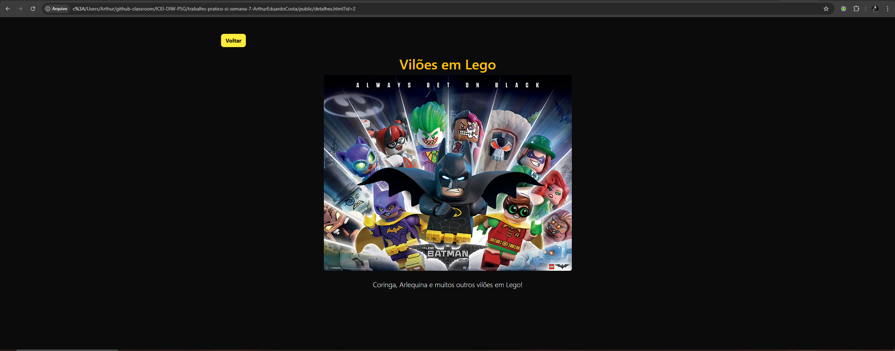
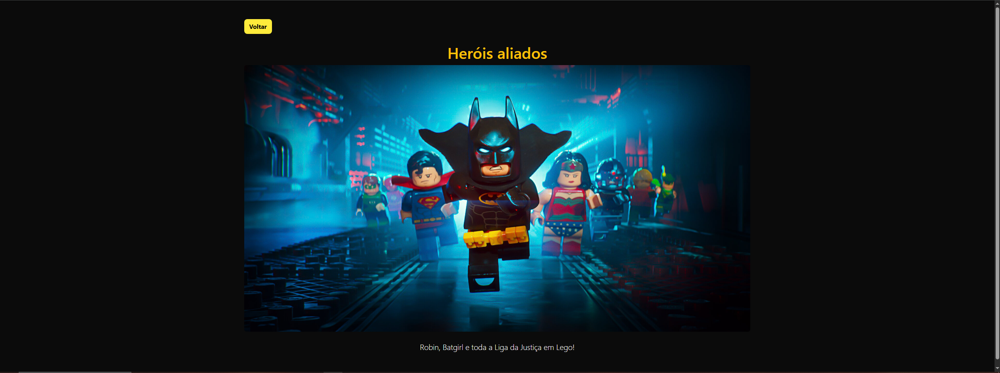

[](https://classroom.github.com/online_ide?assignment_repo_id=20895547&assignment_repo_type=AssignmentRepo)
# Trabalho Prático 05 - Semanas 7 e 8

**Páginas de detalhes dinâmicas**

Nessa etapa, vamos evoluir o trabalho anterior, acrescentando a página de detalhes, conforme o  projeto escolhido. Imagine que a página principal (home-page) mostre um visão dos vários itens que existem no seu site. Ao clicar em um item, você é direcionado pra a página de detalhes. A página de detalhe vai mostrar todas as informações sobre o item do seu projeto. seja esse item uma notícia, filme, receita, lugar turístico ou evento.

Leia o enunciado completo no Canvas. 

**IMPORTANTE:** Assim como informado anteriormente, capriche na etapa pois você vai precisar dessa parte para as próximas semanas. 

**IMPORTANTE:** Você deve trabalhar e alterar apenas arquivos dentro da pasta **`public`,** mantendo os arquivos **`index.html`**, **`styles.css`** e **`app.js`** com estes nomes, conforme enunciado. Deixe todos os demais arquivos e pastas desse repositório inalterados. **PRESTE MUITA ATENÇÃO NISSO.**

## Informações Gerais

- Nome: Arthur Eduardo de Oliveira Costa 
- Matricula:  902839
- Proposta de projeto escolhida: Lego batman
- Breve descrição sobre seu projeto: O site fala sobre Lego batman

## Print da Home-Page

<<  COLOQUE A IMAGEM AQUI >> 

## Print da página de detalhes do item

<<  COLOQUE A IMAGEM AQUI >> ,  , 

## Cole aqui abaixo a estrutura JSON utilizada no app.js

```javascript
const dados = [
  {
    id: 1,
    titulo: "A Batcaverna",
    descricao: "Curiosidades sobre a Batcaverna!",
    imagem: "https://static.wikia.nocookie.net/the-lego-batman-movie/images/a/a8/The_Batcave.png"
  },
  {
    id: 2,
    titulo: "Vilões em Lego",
    descricao: "Coringa, Arlequina e muitos outros vilões em Lego!",
    imagem: "https://hype.my/wp-content/uploads/2017/01/batman-lego-movie.jpeg"
  },
  {
    id: 3,
    titulo: "Heróis aliados",
    descricao: "Robin, Batgirl e toda a Liga da Justiça em Lego!",
    imagem: "https://occ-0-8407-2219.1.nflxso.net/dnm/api/v6/Z-WHgqd_TeJxSuha8aZ5WpyLcX8/AAAABX22eQkAjt_KkCBVEc-lTf_b4g66felyflvkrF7HyqSe_SgCAiwZUV54L5-mnj7M7_BaJvH_dP0WVEb3Yo4wrOCOXM5EQAnC6woz.jpg?r=d3c"
  }
  
]
```